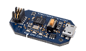
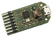
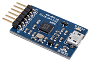

## Abstract

L-Tek provides 3 daplink probes for programming mbed/daplink enabled boards:

* **SWDAP**

  
  

- - -

* **DIPDAP** 

  

- - -

* **CMSIS-DAP**

  
  

- - -

Its supported features and information are gathered in this table:

|               | SWD | UART | JTAG | CONNECTOR                        | INFO                                                                                                                                                                    | ORDERING                                                       |
|---------------|-----|------|------|----------------------------------|-------------------------------------------------------------------------------------------------------------------------------------------------------------------------|----------------------------------------------------------------|
| **SWDAP**     | x   |      |      | Micro SWD 10pin connector 0.05"  | [mbed](https://os.mbed.com/platforms/SWDAP-LPC11U35/), [github](https://github.com/ARMmbed/mbed-HDK/tree/master/Production%20Design%20Projects/ARM-mbed/DAPLink/SWDAP)   |  [web shop](https://l-tek.si/web-shop/l-tek-swdap-interface/)  |
| **DIPDAP**    | x   | x    |      | Non-standard 6pin               | [mbed](https://os.mbed.com/platforms/DIPDAP-LPC11U35/), [github](https://github.com/ARMmbed/mbed-HDK/tree/master/Production%20Design%20Projects/ARM-mbed/DAPLink/DIPDAP) | info@ltek.si                                                   |
| **CMSIS-DAP** | x   |      | x    | Non-standard 7pin                | [tutorial](docs/cmsis-dap.md)                                                                                                                                                                  |  [web shop](https://l-tek.si/web-shop/cmsis-dap-debug-probe/)  |

- - -
