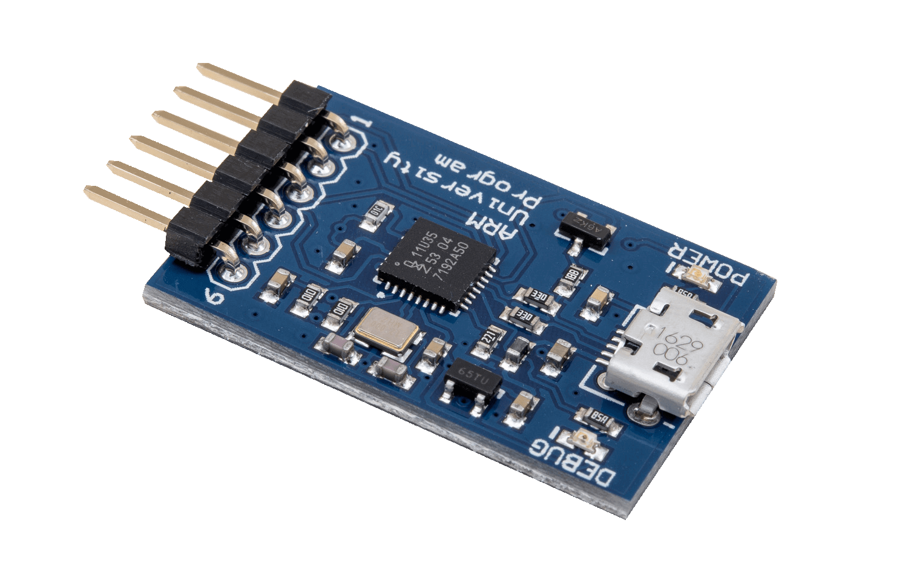
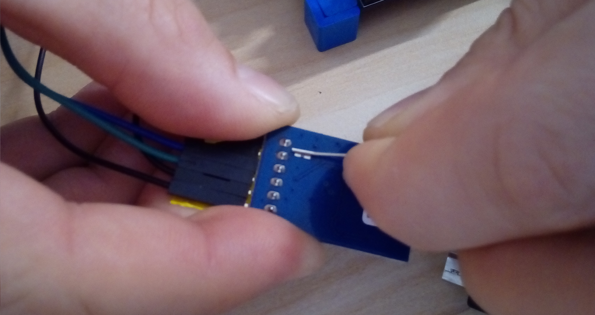
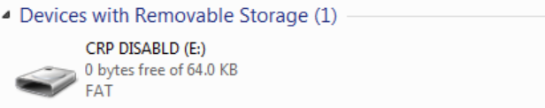
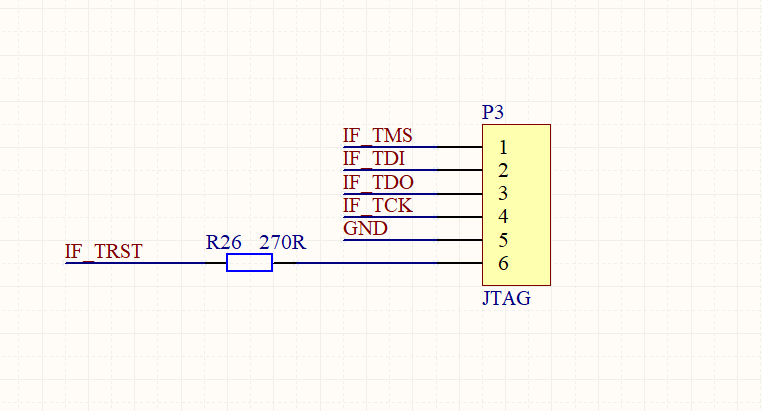
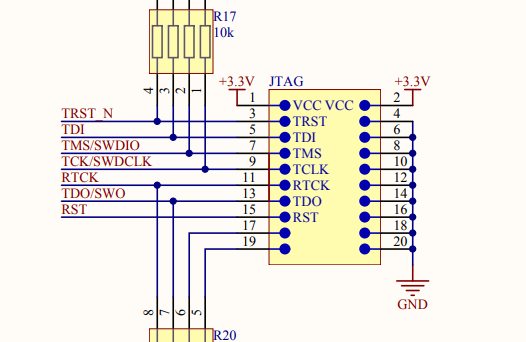
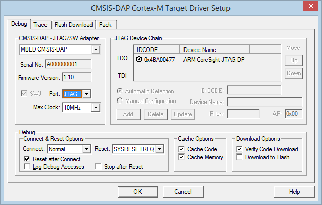
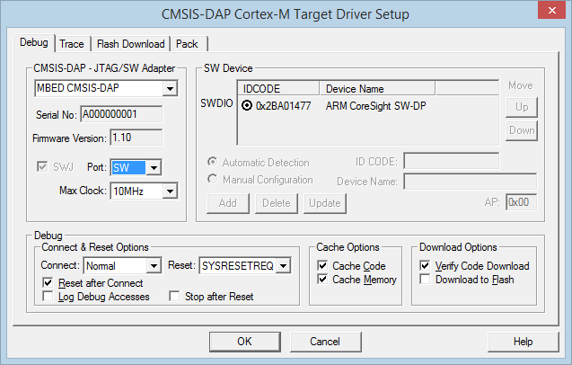
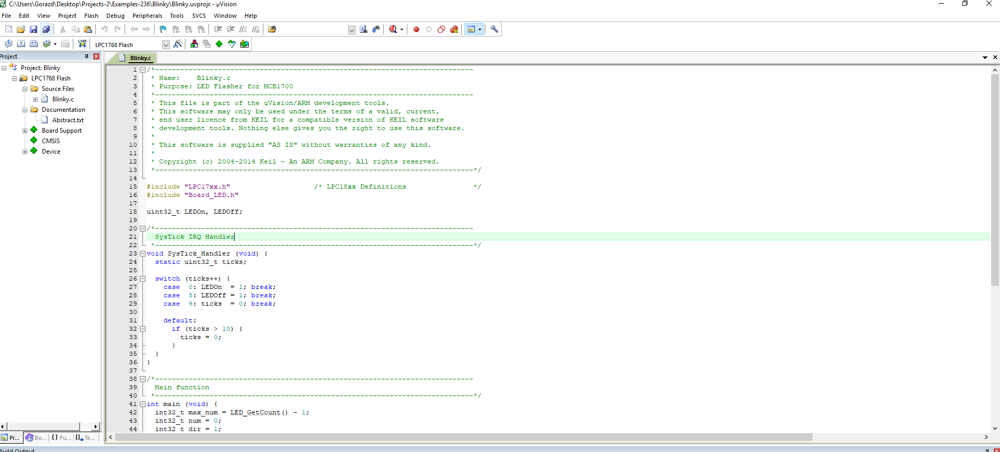

## CMSIS-DAP Tutorial

### Abstract

In this tutorial we  use CMSIS-DAP to program a MCB1700 board. We program a blinky example in Keil Uvision 5.

### Prerequisites

Make sure your CMSIS-DAP is running the correct [firmware](usbd_hid_dap.bin).

To install the firmware, first you have to trigger the bootloader by shorting the pads before powering up the board:

**CRP_DISABLED** drive should show in your computer. Delete the firmware.bin and drag and drop the new [firmware](usbd_hid_dap.bin) file. Reset the board.

### Tutorial

First connect your CMSIS-DAP to MCB1700 over JTAG itnerface.  CMSIS-DAP interface is 

whereas MCB1700 interface is

Hence, the connected boards: 

In Keil Uvision you can now choose to program over **JTAG interface**:

or swd interface:

That's it. You can now compile and load the program:

